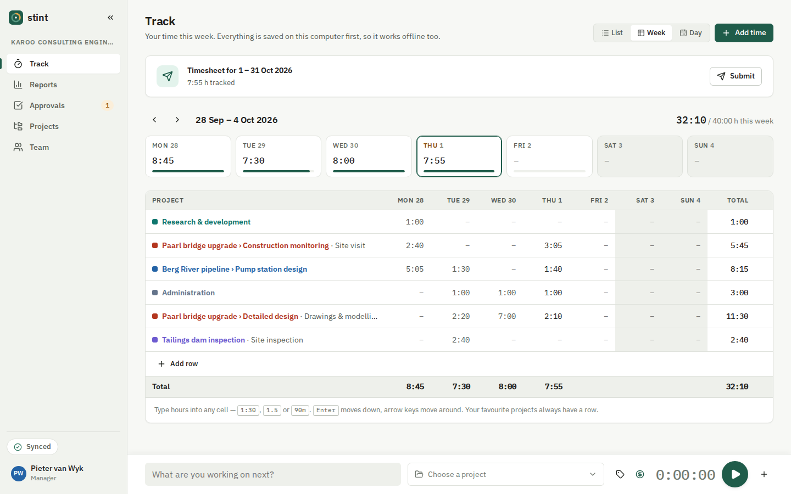
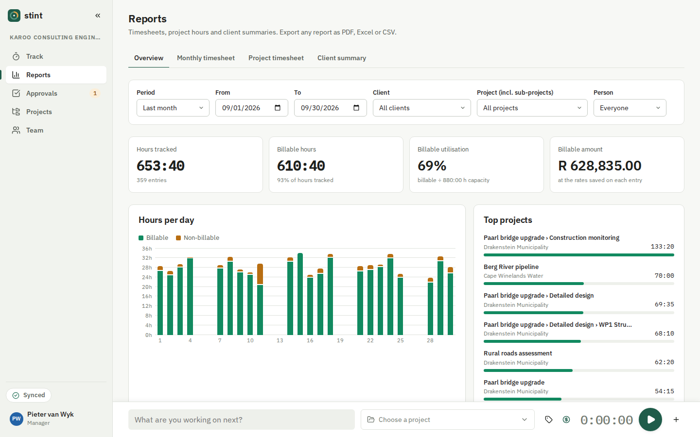
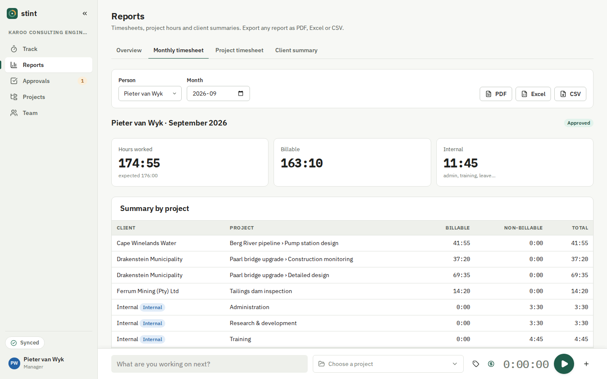
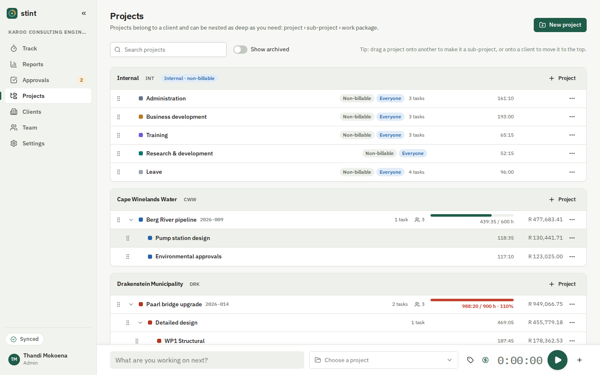
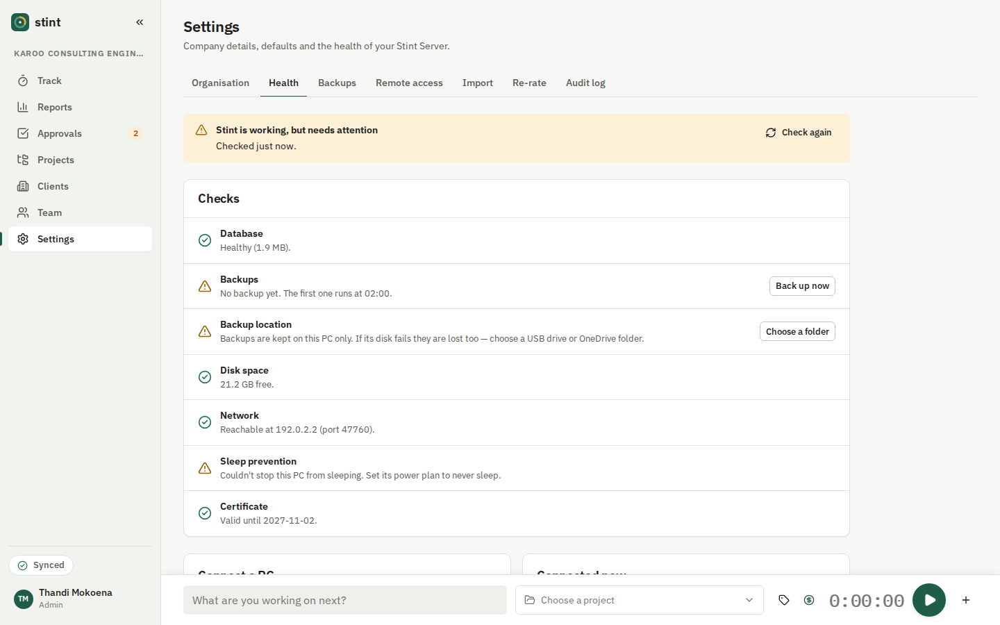
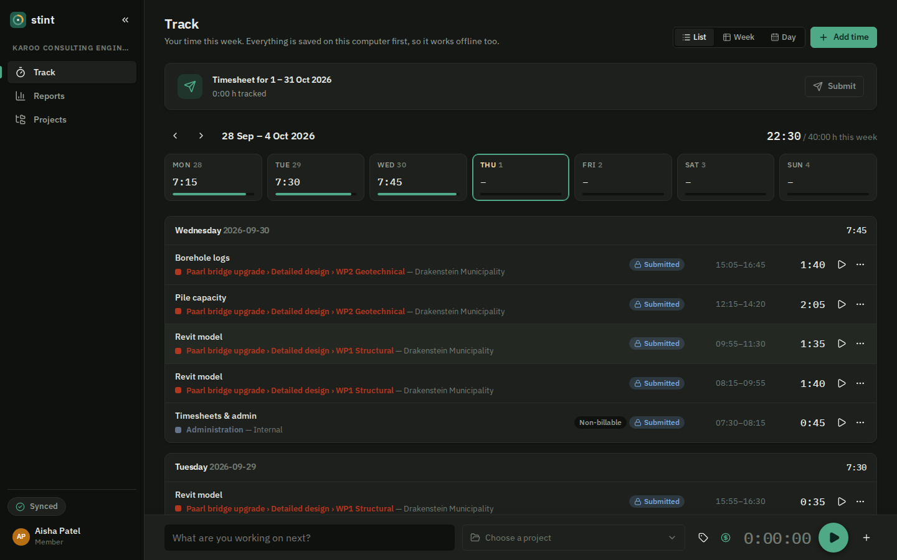
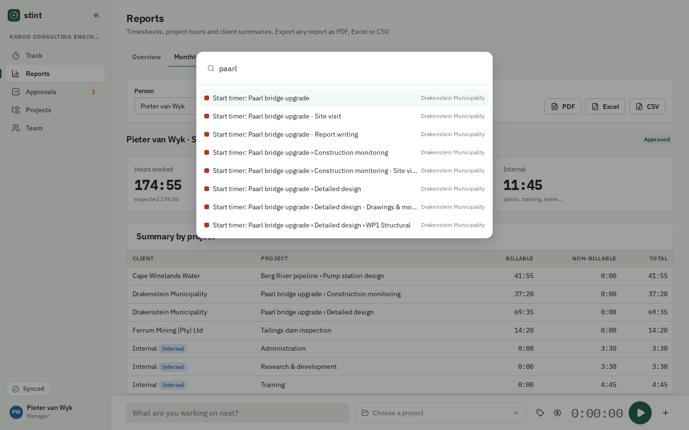
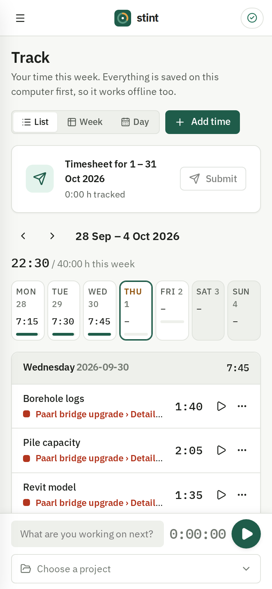

# Stint

**Time tracking for firms that bill by the hour, running on your own office PC.**

Stint is a free, self-hosted time tracker for small engineering and consulting firms. One office
computer runs **Stint Server**. Everyone else installs the **Stint app** (or uses a browser),
picks the company from a list and signs in. You don't need the cloud, a subscription or an IT
department.



| | |
| --- | --- |
|  |  |
|  |  |
|  |  |

<p align="center"></p>

## What it does

**Tracking**
- A timer that is always on screen, with the project picker, tags and billable switch beside it.
  Press <kbd>S</kbd> anywhere to start or stop it.
- Manual entries, duplicate and "continue", a spreadsheet-style **weekly grid** and a **day
  calendar** where you drag to move or resize blocks.
- Favourites and recent projects. A command palette (<kbd>Ctrl</kbd>+<kbd>K</kbd>) and keyboard
  shortcuts for everything (<kbd>?</kbd> lists them).
- **Works offline.** Everything is saved on your own computer first and syncs when the server
  is reachable. A status pill shows *Synced*, *Pending* or *Offline*.
- The desktop app lives in the system tray. It asks what to do with time you were away from the
  PC (idle detection) and reminds you about missing days.

**Organising work**
- Clients, plus a built-in *Internal* client for admin, training, business development and
  leave.
- Projects nested to any depth (*Bridge upgrade › Detailed design › WP1*), with totals that roll
  up and a drag-and-drop tree editor.
- Tasks and tags. Budgets in hours or rand, with warnings at 80 % and 100 %.
- Rates per task, per person on a project, per project, per client, per person or for the whole
  firm; the most specific one wins. The rate is frozen on each entry, so changing a rate never
  rewrites past invoices. A re-rate tool exists for when you really do want to reprice.

**Timesheets and approvals**
- Admin, Manager and Member roles, enforced on the server.
- People submit their week or month. Managers approve or send it back with a comment.
  Approved periods are locked. An admin can unlock one, with a reason that is kept in the
  audit log.
- An audit log of every change to time data.

**Reports and exports**
- Company dashboard, monthly timesheet per person, project timesheet (whole sub-tree) and
  client summary for invoicing.
- Export to **PDF** (with your logo and a signature line), **Excel** and **CSV**.

**Looking after itself**
- Nightly backups to a USB drive or OneDrive folder (the last 30 are kept), and one-click
  restore.
- A **Health** page in plain language, with one-click fixes.
- Update notices from GitHub Releases. CSV import, including **Toggl Track** exports.

South African defaults: ZAR, Africa/Johannesburg, YYYY-MM-DD dates and weeks that start on
Monday. All of these can be changed in Settings.

## Quick start (no technical knowledge needed)

### 1. Install the server on one office PC

Pick a PC that stays on during working hours (Windows 10 or 11, 64-bit).

1. Download **`StintServer-Setup-x.y.z.exe`** from the
   [latest release](https://github.com/IzakJacobus/Tracker/releases/latest) and run it.
   Windows may warn that the app is from an unknown publisher. Click **More info → Run anyway**.
2. Click **Next** until it finishes. The installer:
   - installs Stint Server as a Windows service that starts with the PC,
   - lets Stint through Windows Firewall on **Private** and **Domain** networks (never on Public
     ones), and
   - stops the PC from going to sleep while Stint runs (the screen can still switch off).
3. A browser opens with the **setup wizard**. Enter your firm's name, create your admin account,
   add your first clients and projects, and invite your team.

You can get back to it any time from the Start menu: **Stint Server**.

### 2. Install the app on everyone else's PC

1. Download **`Stint_x.y.z_x64-setup.exe`** from the same release and run it. It installs for
   the current user, so no admin rights are needed.
2. Open Stint. It **finds the office server by itself** and shows your firm's name. Click it and
   sign in.
3. If it can't find the server (some office networks block discovery), type the **pairing code**
   shown on the server's Health page, for example `R2M0-255S-Y1YK-82FK-HRZT-A9AB`.

**Linux desktops:** install the `.deb` (Debian, Ubuntu, Mint) or run the `.AppImage` from the
release. It works the same way. Idle detection works on GNOME and on any X11 desktop; on other
Wayland desktops (KDE Plasma, Sway) the app simply doesn't ask about time away.

Phones, tablets and Macs can use a browser instead. Open `https://<server-pc-name>.local:47600`
on the office network. The first time, the browser warns about the certificate, because
Stint makes its own (see [Troubleshooting](#troubleshooting)). You can then install it as an app
from the browser menu.

### Running the server on Linux instead

Any 64-bit Linux with systemd works (x64 or arm64, so a Raspberry Pi 4/5 is fine). Download
`stint-server-x.y.z-linux-x64.tar.gz` (or `-linux-arm64`) from the release, then:

```bash
tar xzf stint-server-*-linux-*.tar.gz && cd stint-server-*/
sudo ./install.sh
```

The script creates a `stint` service account, installs the `stint-server` service (it starts
at boot), keeps the computer from sleeping, and, if ufw or firewalld is on, opens Stint's ports
to private networks only. It then prints the setup address. Setup only opens on the server
itself, so on a server without a screen it also prints the `ssh -L …` command that lets you
finish setup from your own computer's browser.

Re-run `sudo ./install.sh` from a newer release to upgrade.
`sudo ./install.sh --uninstall` removes Stint but keeps the data in `/var/lib/stint`; add
`--purge` to delete that too. Logs: `journalctl -u stint-server`.

## Backups and restore

Stint backs up every night at 02:00. If the PC was off then, it backs up as soon as it starts.

- **Choose where backups go:** Settings → **Backups** → *Change folder*. Pick a USB drive or a
  OneDrive folder, so that a failed disk in the server PC can't take the backups with it. Stint
  makes a test backup there before it switches.
- **Back up now** makes a backup straight away. The last 30 are kept (you can change this).
- **Restore:** Settings → Backups → *Restore* next to the backup you want. Stint first saves a
  safety copy of the current data, so a restore can itself be undone. Everyone's app then
  reloads its data.
- A backup is also made automatically before every upgrade.

**Moving to a new server PC:** install Stint Server on the new PC, copy a backup file across,
put it in the new PC's backup folder (`C:\ProgramData\Stint\backups`, which needs
administrator rights) and restore it. Pairings keep working, because the server's certificate
is stored inside the backup. Stint restarts itself to load it.

## Upgrading

- Admins see **"Stint x.y is available"** in the sidebar and on the Health page.
- **Server:** download the new `StintServer-Setup` and run it on the server PC. It stops the
  service, replaces the program, backs up the database and starts again. Your data stays where
  it is.
- **App:** after the server, run the new `Stint_x.y.z_x64-setup.exe` on each PC. It keeps the
  pairing and any time that hasn't synced yet.

## Working from home (optional)

Stint works on the office network with no extra setup. To reach it from home or from site, we
recommend **[Tailscale](https://tailscale.com)**: a private network between your own devices,
with nothing exposed to the internet. Its free plan covers up to 6 users. Step-by-step guide:
[docs/REMOTE_ACCESS.md](docs/REMOTE_ACCESS.md), or Settings → **Remote access**.

## Troubleshooting

| Problem | What to do |
| --- | --- |
| The app can't find the server | Check that the server PC is on, and that both PCs are on the same office network. Type the pairing code from the server's **Health** page instead. |
| Health says the network is **Public** | Windows blocks other PCs on Public networks. On the Health page click **Mark as Private** (only if this really is your office network), or use Windows Settings → Network → *Private*. |
| Health says the **firewall rule is missing** | Run the Stint Server installer again; it repairs the rule. |
| The browser says the connection isn't private | Stint uses its own certificate. Download `http://<server-pc>:47601/stint-ca.crt` and install it as a *Trusted Root Certification Authority* to stop the warning. The desktop app doesn't need this. |
| "Sync pending" never clears | You're probably offline or the server PC is asleep or off. Your entries are safe on your PC and upload when the server is back. |
| "That period is submitted or approved" | Approved timesheets are locked. Ask your manager to send it back, or an admin to unlock it. |
| A backup failed | Health shows why. Usually the USB drive is unplugged or full. Plug it in and click **Back up now**. |
| Port 47600 is in use | Stint moves to the next free port by itself (47602, 47604, …). Clients find it again automatically. |
| Something else | Logs are in `C:\ProgramData\Stint\logs` on the server PC. Please [open an issue](https://github.com/IzakJacobus/Tracker/issues) and include them. |

## Documentation

- [How to open Stint](docs/OPENING_STINT.md): the app or a browser, and working offline (for staff)
- [User guide](docs/USER_GUIDE.md): for everyone who tracks time
- [Admin guide](docs/ADMIN_GUIDE.md): setting up the firm, people, rates, approvals, backups
- [Remote access](docs/REMOTE_ACCESS.md): Tailscale (recommended) or Cloudflare Tunnel
- [Architecture](docs/ARCHITECTURE.md): how it works, sync, security and networking
- [Install test](docs/INSTALL_TEST.md): clean-Windows install checklist and results
- [Releasing](docs/RELEASING.md): how a release is built
- [Changelog](CHANGELOG.md), [Roadmap](docs/ROADMAP.md), [Progress](docs/PROGRESS.md)

## For developers

You need [Bun](https://bun.sh) 1.3 or later. Building the desktop app also needs Rust and the
[Tauri prerequisites](https://tauri.app/start/prerequisites/).

```bash
bun install
bun run check                       # lint, type-check, unit and integration tests
bun run test:e2e                    # Playwright end-to-end tests (builds the web client)

# A demo firm (Karoo Consulting Engineers, 5 people, 3 months of time):
STINT_DATA_DIR=./apps/server/data bun run seed -- --reset     # password: stint demo 2026
bun run --filter @stint/web build
STINT_DATA_DIR=./apps/server/data STINT_WEB_DIR=./apps/web/dist bun apps/server/src/main.ts
# → http://localhost:47601  (sign in as thandi@karoo.co.za)

bun apps/server/scripts/build.ts --target windows-x64   # single-file server executable
cd apps/desktop && bunx tauri build                      # desktop app installer
```

Configuration: `<data folder>/stint.config.json` or `STINT_*` environment variables. See
[apps/server/stint.config.example.json](apps/server/stint.config.example.json). No secrets live
in the repository: keys and certificates are generated on first start.

Contributions are welcome. See [CONTRIBUTING.md](CONTRIBUTING.md).

## Licence

[MIT](LICENSE)
